# Java Multithreading & Concurrency — Interview Ready Guide

> **Goal:** Understand Java multithreading from fundamentals to Spring Boot production usage, with simple examples and interview-friendly explanations.

---

## 1. Program vs Process vs Thread

### Program

A **program** is a set of instructions stored on disk.

Example:

```text
MySpringBootApplication.jar
```

### Process

A **process** is a running instance of a program.

```text
Program
   |
   v
Process
```

A Java application starts as a process. A process has its own memory space and can contain multiple threads.

### Thread

A **thread** is a lightweight unit of execution inside a process.

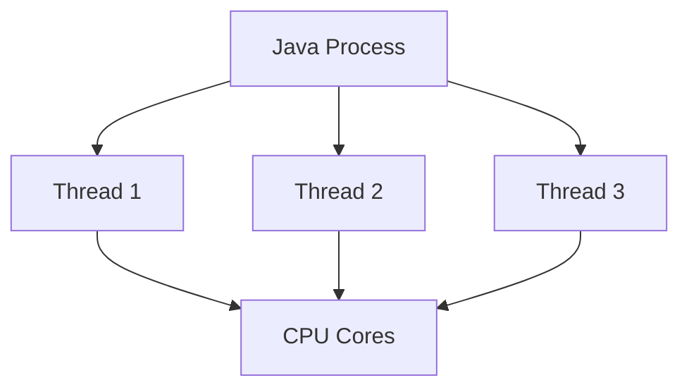

### Interview answer

> A process is an independent running application, while a thread is a lightweight execution unit inside a process. Multiple threads in the same process share process resources such as heap memory.

---

# 2. Single-threaded vs Multithreaded Application

## Single Thread

One task executes at a time.

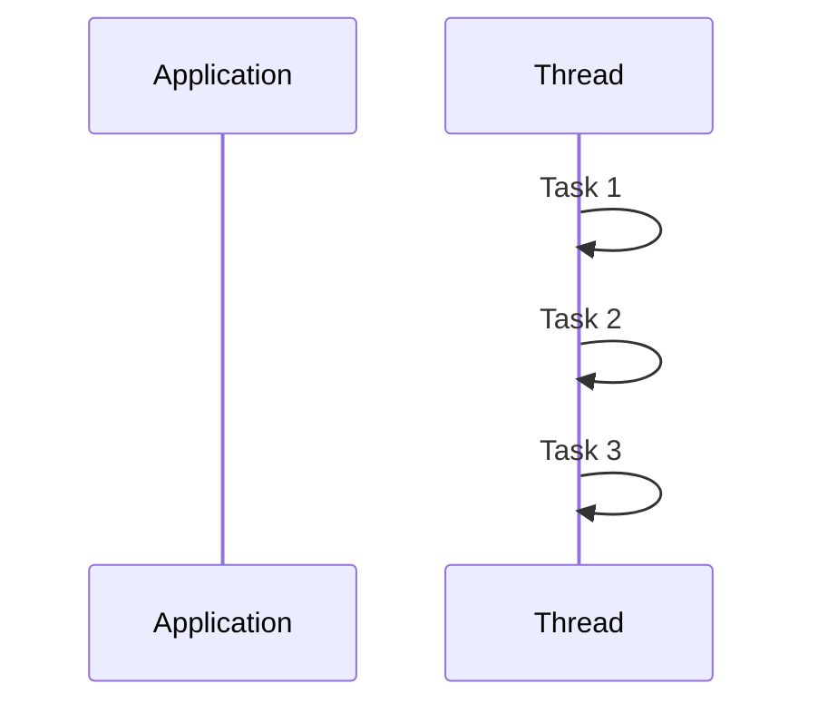

If Task 1 takes 5 seconds, Task 2 has to wait.

## Multithreaded

Multiple tasks can make progress concurrently.

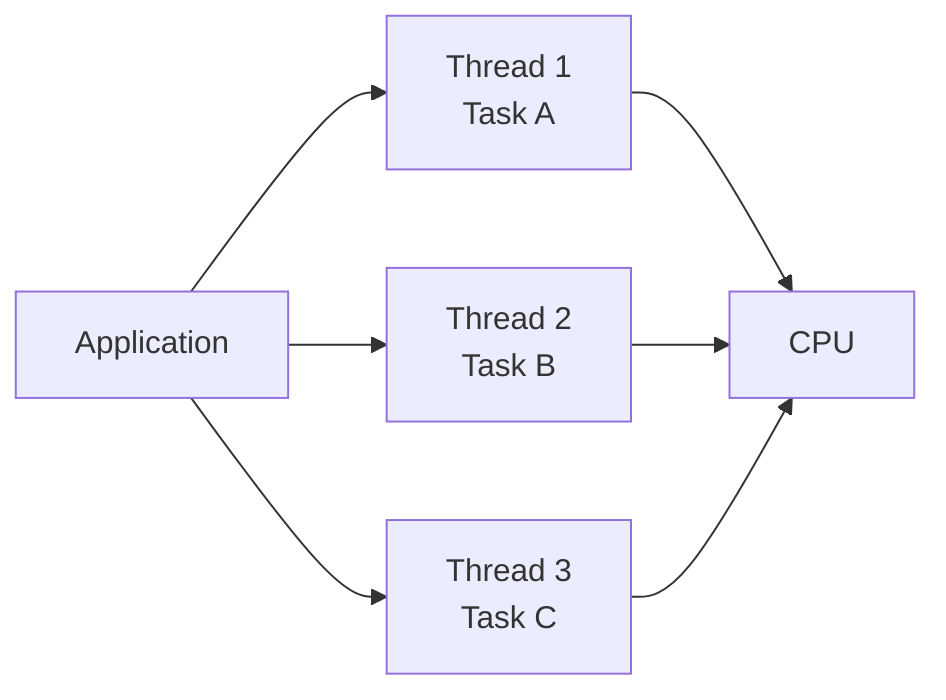

### Important CPU point

An 8-core CPU can execute up to **8 threads simultaneously at a given instant** on 8 cores.

However, an application can have many more threads in the `RUNNABLE` state. The OS scheduler gives CPU time to runnable threads.

> **Interview trap:** "8-core CPU means the application can have only 8 threads."  
> **Wrong.** It can have hundreds or thousands of threads; only a limited number can execute on CPU cores simultaneously.

---

# 3. Java Thread States

Java's `Thread.State` contains:

```text
NEW
RUNNABLE
BLOCKED
WAITING
TIMED_WAITING
TERMINATED
```

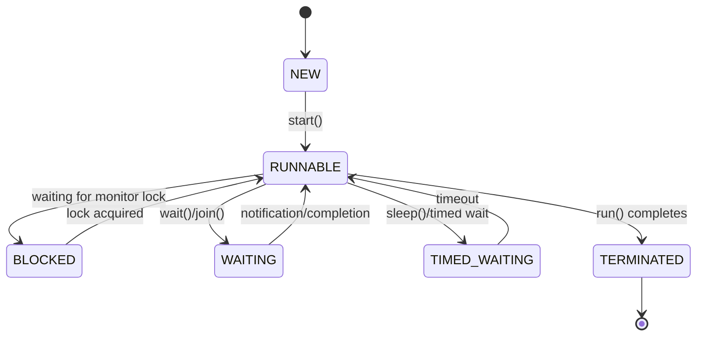

### Easy example

```java
Thread thread = new Thread(() -> {
    System.out.println("Running...");
});

System.out.println(thread.getState()); // NEW

thread.start();

System.out.println(thread.getState()); // usually RUNNABLE
```

### Interview answer

> A Java thread moves through states such as NEW, RUNNABLE, BLOCKED, WAITING, TIMED_WAITING and TERMINATED depending on what it is doing and what it is waiting for.

---

# 4. Runnable vs Callable

Both are used to define work that can be executed by another thread.

## Runnable

Use `Runnable` when you **do not need a return value**.

```java
Runnable task = () -> {
    System.out.println("Processing order...");
};

new Thread(task).start();
```

Important points:

- `run()` returns `void`
- Does not return a result
- Cannot directly throw a checked exception from `run()`
- Commonly used with `ExecutorService`

## Callable

Use `Callable<V>` when the task **returns a result**.

```java
Callable<Integer> task = () -> {
    return 10 + 20;
};
```

`Callable`:

```java
V call() throws Exception;
```

Example:

```java
ExecutorService executor = Executors.newFixedThreadPool(2);

Future<Integer> future = executor.submit(() -> 10 + 20);

Integer result = future.get();

System.out.println(result); // 30

executor.shutdown();
```

### Runnable vs Callable

| Feature | Runnable | Callable |
|---|---|---|
| Method | `run()` | `call()` |
| Return value | No | Yes |
| Checked exception | No | Yes |
| Common execution | Thread / Executor | ExecutorService |
| Result | None | Usually through `Future<V>` |

### Interview answer

> Runnable is suitable for fire-and-forget work with no return value, while Callable is suitable when a task needs to return a result or throw a checked exception.

---

# 5. Java Executor Framework

Creating a new thread for every task is usually not a good production approach.

```java
new Thread(task).start();
```

For many tasks, prefer a **thread pool**.

Java introduced the Executor framework in Java 5 under:

```java
java.util.concurrent
```

## Why Executor Framework?

It separates:

```text
Task
  |
  v
Task Submission
  |
  v
Thread Management
  |
  v
Thread Pool
  |
  v
Task Execution
```

Instead of manually creating and managing threads, the executor manages worker threads for you.

---

# 6. Executor Hierarchy

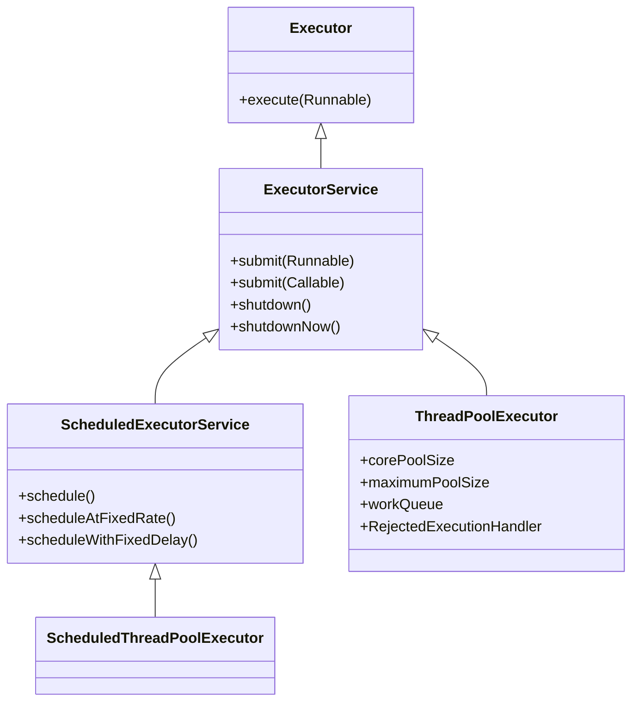

---

# 7. Executor

The basic interface is `Executor`.

```java
Executor executor = command -> {
    new Thread(command).start();
};

executor.execute(() ->
    System.out.println("Task running")
);
```

The main method is:

```java
void execute(Runnable command);
```

### Interview answer

> Executor is the basic abstraction for executing tasks. It hides the details of how the task is executed, whether by a new thread, pooled thread, or another execution strategy.

---

# 8. ExecutorService

`ExecutorService` extends `Executor` and provides more features.

```java
ExecutorService executor =
        Executors.newFixedThreadPool(3);
```

Submit a Runnable:

```java
executor.submit(() -> {
    System.out.println("Task executed");
});
```

Submit a Callable:

```java
Future<String> future =
        executor.submit(() -> "Success");

System.out.println(future.get());
```

Always shut down an executor when it is no longer required:

```java
executor.shutdown();
```

---

# 9. ThreadPoolExecutor

`ThreadPoolExecutor` is one of the most important executor implementations.

It manages:

- Core worker threads
- Maximum worker threads
- Work queue
- Keep-alive time
- Rejected execution policy

### Conceptual flow

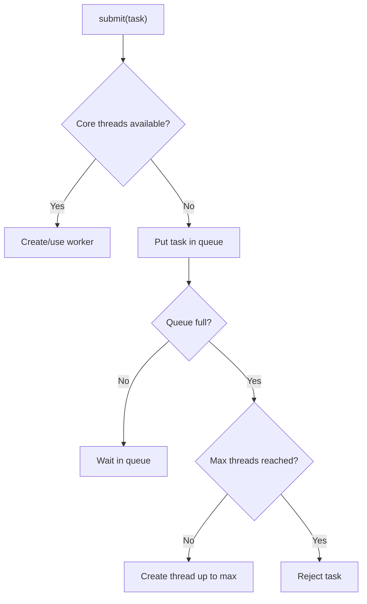

### Example

```java
ThreadPoolExecutor executor =
        new ThreadPoolExecutor(
                3,                         // corePoolSize
                4,                         // maximumPoolSize
                2,                         // keepAlive
                TimeUnit.SECONDS,
                new ArrayBlockingQueue<>(3),
                new ThreadPoolExecutor.DiscardOldestPolicy()
        );
```

### Interview explanation

> First, core worker threads are used. When they are busy, tasks are normally queued. If the queue becomes full, the executor can create additional threads up to the maximum pool size. If the pool and queue are exhausted, the rejection policy is applied.

---

# 10. Executors Factory Methods

### Fixed thread pool

```java
ExecutorService executor =
        Executors.newFixedThreadPool(5);
```

Useful when you want a fixed number of worker threads.

### Single thread executor

```java
ExecutorService executor =
        Executors.newSingleThreadExecutor();
```

Tasks execute sequentially using one worker thread.

### Scheduled thread pool

```java
ScheduledExecutorService scheduler =
        Executors.newScheduledThreadPool(2);
```

Useful for delayed or periodic tasks.

---

# 11. Future

When a `Callable` is submitted:

```java
Future<Integer> future =
        executor.submit(() -> 100);
```

The `Future` is like a **ticket for a result that may be available later**.

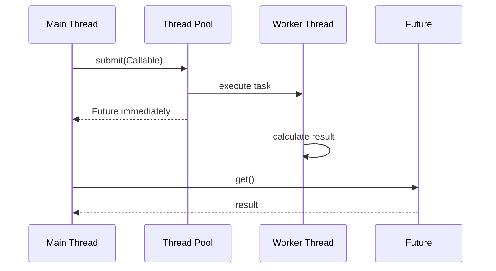

## The important problem with Future

This is blocking:

```java
Integer result = future.get();
```

If the result is not ready, the calling thread waits.

Conceptually:

```text
submit()
   |
   +---- Future returned immediately
   |
   +---- worker calculates result
   |
   +---- get()
           |
           +---- result ready -> return
           |
           +---- result not ready -> BLOCK
```

### Interview answer

> Future allows us to represent an asynchronous result, but `get()` can block the calling thread. Future also does not provide convenient built-in result chaining such as "when this completes, execute the next operation."

---

# 12. CompletableFuture

`CompletableFuture` was introduced in Java 8.

It implements `Future` and adds asynchronous composition.

Instead of:

```java
Future<Integer> future = executor.submit(() -> 10);

Integer result = future.get(); // blocking
```

you can write:

```java
CompletableFuture
        .supplyAsync(() -> 10)
        .thenApply(value -> value * 2)
        .thenAccept(System.out::println);
```

Output:

```text
20
```

## CompletableFuture pipeline

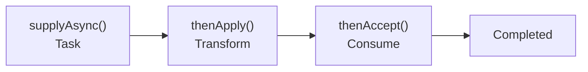

### Easy example

```java
CompletableFuture<Integer> future =
        CompletableFuture.supplyAsync(() -> {
            System.out.println("Calculating...");
            return 10;
        });

future
    .thenApply(value -> value * 2)
    .thenAccept(result ->
        System.out.println("Result = " + result)
    );
```

### Important clarification

`CompletableFuture` does **not** automatically mean "all threads in the pool are occupied."

For example:

```java
CompletableFuture.supplyAsync(...)
```

uses an executor (the common pool by default unless you provide your own executor).

If you have 100 tasks and a limited pool, tasks still compete for available worker threads.

---

# 13. Future vs CompletableFuture

| Feature | Future | CompletableFuture |
|---|---|---|
| Introduced | Java 5 | Java 8 |
| Represents async result | Yes | Yes |
| `get()` | Yes | Yes |
| Chaining | Limited | Excellent |
| Callbacks | No convenient API | Yes |
| Combine tasks | Difficult | `thenCombine`, `allOf`, `anyOf` |
| Exception handling | Basic | `exceptionally`, `handle`, `whenComplete` |
| Manual completion | No | Yes |

### Interview answer

> Future is useful for obtaining an asynchronous result, but its API is mostly retrieval-oriented. CompletableFuture adds non-blocking composition, callbacks, task combination and structured exception handling.

---

# 14. Combining CompletableFutures

## thenCombine

Use when two independent tasks produce results and you want to combine them.

```java
CompletableFuture<Integer> price =
        CompletableFuture.supplyAsync(() -> 100);

CompletableFuture<Integer> tax =
        CompletableFuture.supplyAsync(() -> 18);

CompletableFuture<Integer> total =
        price.thenCombine(
                tax,
                (p, t) -> p + t
        );

total.thenAccept(System.out::println);
```

Flow:

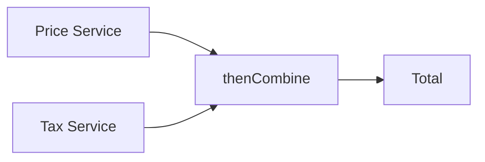

## allOf

Useful when multiple independent tasks must all complete.

```java
CompletableFuture<Void> all =
        CompletableFuture.allOf(
                task1,
                task2,
                task3
        );
```

## anyOf

Completes when any one of the supplied futures completes.

```java
CompletableFuture<Object> first =
        CompletableFuture.anyOf(
                task1,
                task2,
                task3
        );
```

---

# 15. CompletableFuture Exception Handling

```java
CompletableFuture
    .supplyAsync(() -> {
        throw new RuntimeException("Service failed");
    })
    .exceptionally(ex -> {
        System.out.println(ex.getMessage());
        return 0;
    });
```

Other useful methods:

```java
.exceptionally(...)
.handle(...)
.whenComplete(...)
```

### Interview answer

> CompletableFuture provides methods such as exceptionally, handle and whenComplete to deal with failures and completion events without putting all logic into blocking get calls.

---

# 16. Spring Boot Task Scheduling

Spring Boot supports scheduling using:

```java
@EnableScheduling
```

and:

```java
@Scheduled
```

Example:

```java
@Configuration
@EnableScheduling
public class SchedulingConfig {
}
```

```java
@Component
public class CleanupJob {

    @Scheduled(fixedDelay = 5000)
    public void cleanup() {
        System.out.println("Cleanup running...");
    }
}
```

---

# 17. @Scheduled Parameters

## fixedRate

Interval is measured between the **start times** of executions.

```java
@Scheduled(fixedRate = 5000)
public void task() {
}
```

Concept:

```text
Start ---- 5 sec ---- Start ---- 5 sec ---- Start
```

## fixedDelay

Delay is measured after the previous execution completes.

```java
@Scheduled(fixedDelay = 5000)
public void task() {
}
```

Concept:

```text
Start -- task -- End -- 5 sec -- Start
```

## initialDelay

Delays the first execution.

```java
@Scheduled(
    fixedRate = 5000,
    initialDelay = 10000
)
public void task() {
}
```

## cron

Useful for calendar-based schedules.

```java
@Scheduled(cron = "0 0 * * * *")
public void hourlyTask() {
}
```

---

# 18. @Scheduled Important Interview Point

A scheduled task can block the scheduling thread if it performs long-running work.

For example:

```java
@Scheduled(fixedRate = 5000)
public void task() throws InterruptedException {
    Thread.sleep(10000);
}
```

Do not assume this means a new thread is automatically created for every execution.

For concurrent scheduled work, configure an appropriate scheduler/thread pool.

Concept:

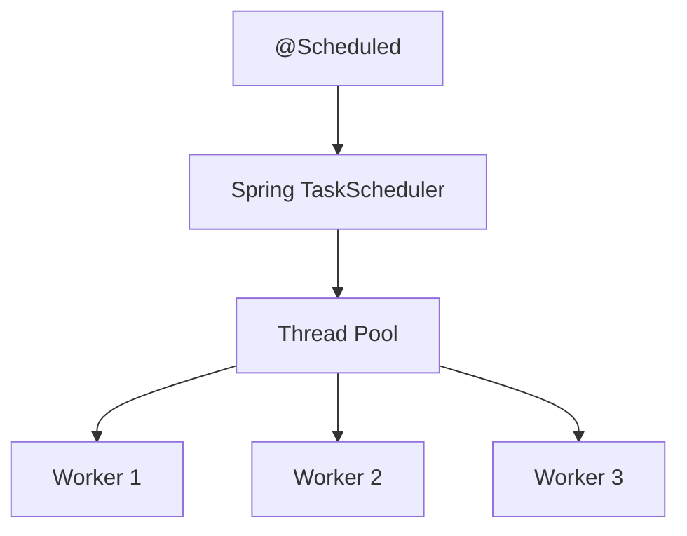

---

# 19. @Async in Spring Boot

`@Async` allows a method to execute asynchronously.

Enable it:

```java
@Configuration
@EnableAsync
public class AsyncConfig {
}
```

Use it:

```java
@Service
public class NotificationService {

    @Async
    public void sendEmail() {
        // long-running operation
    }
}
```

The caller does not need to wait for the operation to finish.

## Better: configure your own executor

```java
@Configuration
@EnableAsync
public class AsyncConfig {

    @Bean("taskExecutor")
    public Executor taskExecutor() {

        ThreadPoolTaskExecutor executor =
                new ThreadPoolTaskExecutor();

        executor.setCorePoolSize(5);
        executor.setMaxPoolSize(10);
        executor.setQueueCapacity(100);
        executor.setThreadNamePrefix("async-");

        executor.initialize();

        return executor;
    }
}
```

Then:

```java
@Async("taskExecutor")
public void sendEmail() {
    // asynchronous work
}
```

### Why custom executor?

A controlled pool gives you better:

- Capacity management
- Thread naming
- Queue control
- Rejection handling
- Production predictability

---

# 20. Tomcat Threading Model

In a Spring Boot web application, Tomcat processes incoming HTTP requests using worker threads.

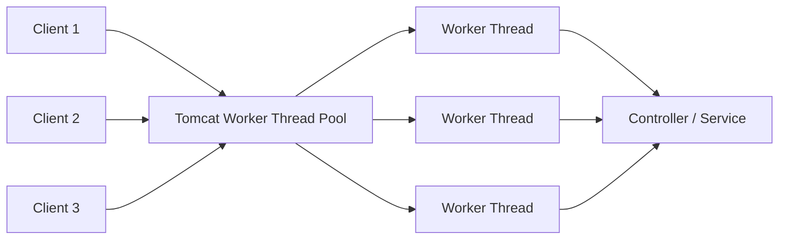

Typical request lifecycle:

```text
HTTP Request
     |
     v
Tomcat Thread Pool
     |
     v
Worker Thread
     |
     v
Controller
     |
     v
Service
     |
     v
Repository / External API
     |
     v
Response
     |
     v
Thread returned to pool
```

---

# 21. Tomcat Blocking Problem

Suppose a request performs a slow database operation:

```text
Request
  |
  v
Tomcat Thread
  |
  +---- Database call: 10 seconds
  |
  +---- Thread is occupied
```

If many requests perform slow operations, the Tomcat worker pool can become exhausted.

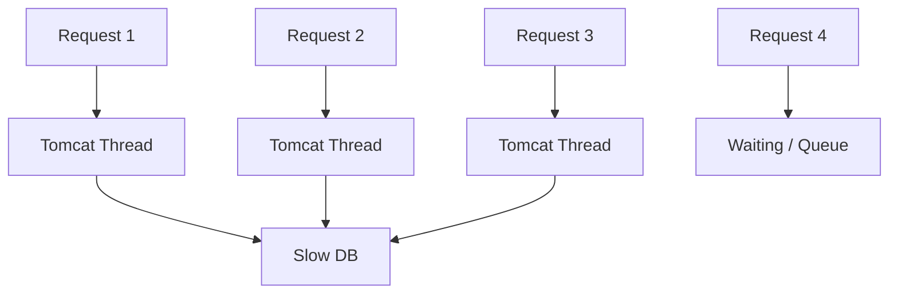

### Interview answer

> In a blocking application, a Tomcat worker thread remains occupied while waiting for a database or external service. If too many requests block simultaneously, available request threads can be exhausted and throughput suffers.

---

# 22. Async Request Flow

The goal is to move long-running work to an appropriate executor when the architecture supports it.

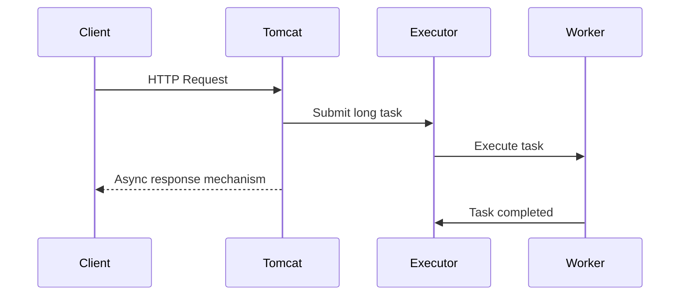

### Important

`@Async` and asynchronous request processing are related concepts but are **not exactly the same thing**.

- `@Async` executes a Spring method asynchronously.
- Servlet async mechanisms such as `DeferredResult`/`Callable` can release the request-processing thread while work continues.
- The design must still consider executor capacity and downstream dependencies.

---

# 23. Spring Bean Thread Safety

Spring beans are singleton-scoped by default.

That means one bean instance can serve many requests concurrently.

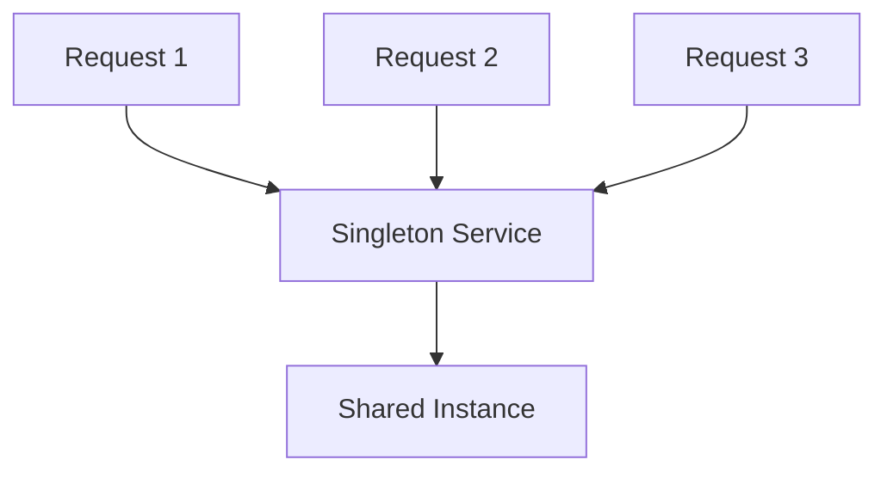

Therefore, avoid storing user-specific mutable state in instance fields.

### Bad

```java
@Service
public class UserService {

    private String currentUser;

    public void process(String user) {
        currentUser = user;
        // ...
    }
}
```

Two requests can overwrite `currentUser`.

### Better

```java
@Service
public class UserService {

    public void process(String user) {
        String currentUser = user;
        // use local state
    }
}
```

Local variables belong to the executing method invocation and are not shared in the same way as mutable instance fields.

### Interview answer

> Spring singleton beans are shared by multiple request threads, so services and controllers should generally be stateless. Request-specific data should be kept in method parameters or local variables rather than mutable instance fields.

---

# 24. Complete Picture

The following diagram connects the major concepts:

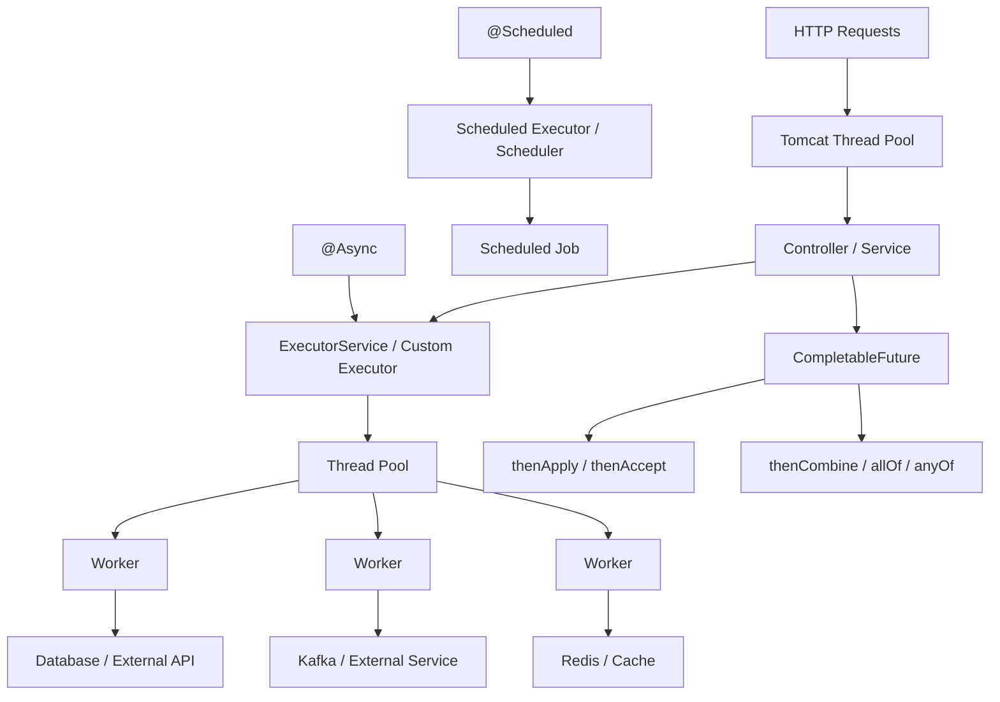

---

# 25. Simple Real-World Example

Imagine an e-commerce API:

```text
POST /orders
```

After creating an order, we need to:

1. Save the order.
2. Send email.
3. Publish Kafka event.
4. Update analytics.

A simple synchronous implementation might do everything on the request thread.

```text
Request
  |
  +--> Save DB
  |
  +--> Send Email
  |
  +--> Kafka
  |
  +--> Analytics
  |
  +--> Response
```

A better design may separate independent work:

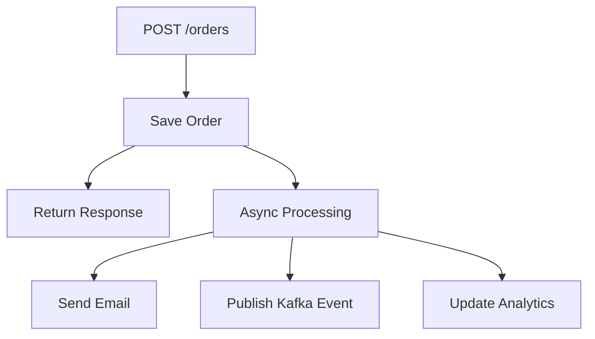

The exact architecture depends on consistency requirements. Do not make every operation asynchronous just because it can be.

---

# 26. CPU-Bound vs I/O-Bound Tasks

This is a common interview topic.

## CPU-bound

Examples:

- Complex calculations
- Image processing
- Compression
- Encryption

The task spends most of its time using CPU.

```text
CPU -> busy
I/O -> low
```

## I/O-bound

Examples:

- Database calls
- REST API calls
- File operations
- Network calls

The thread may spend significant time waiting for external systems.

```text
CPU -> waiting
I/O -> active/waiting
```

### Interview answer

> CPU-bound tasks are limited mainly by processor capacity, while I/O-bound tasks spend significant time waiting for external resources. Thread-pool sizing should consider the workload rather than blindly using one pool size everywhere.

---

# 27. Common Interview Questions

## Q1. What is multithreading?

**Answer:**

> Multithreading is the execution of multiple threads within a process so that multiple tasks can make progress concurrently.

---

## Q2. Process vs Thread?

**Answer:**

> A process is an independent running application with its own resources, while a thread is a lightweight execution unit inside a process and shares process resources.

---

## Q3. Can an 8-core CPU run 100 threads?

**Answer:**

> Yes. It can have 100 threads, but only a limited number can execute simultaneously on the available CPU cores. The OS scheduler switches CPU time among runnable threads.

---

## Q4. Runnable vs Callable?

**Answer:**

> Runnable does not return a result and cannot directly throw checked exceptions. Callable returns a value and can throw checked exceptions.

---

## Q5. Why use ExecutorService?

**Answer:**

> ExecutorService separates task submission from thread management and allows us to reuse worker threads through thread pools instead of creating a new thread for every task.

---

## Q6. execute() vs submit()?

**Answer:**

```text
execute(Runnable)
    -> no Future returned

submit(Runnable/Callable)
    -> Future returned
```

Example:

```java
executor.execute(task);

Future<Integer> result =
        executor.submit(callableTask);
```

---

## Q7. What is Future?

**Answer:**

> Future represents the result of an asynchronous computation. It allows us to check completion, cancel the task and retrieve the result, but `get()` can block.

---

## Q8. Why CompletableFuture?

**Answer:**

> CompletableFuture provides asynchronous composition, chaining, combining multiple operations and exception handling, reducing the need for blocking calls.

---

## Q9. Is CompletableFuture always non-blocking?

**Answer:**

> No. Its API supports asynchronous composition, but methods such as `get()` and `join()` can block. Also, the underlying tasks still consume executor threads.

---

## Q10. What is ThreadPoolExecutor?

**Answer:**

> ThreadPoolExecutor manages worker threads and a task queue. It provides control over core pool size, maximum pool size, queue, keep-alive time and rejection policy.

---

## Q11. fixedRate vs fixedDelay?

**Answer:**

> fixedRate schedules executions based on the start time of previous executions, while fixedDelay waits for the previous execution to finish and then waits for the configured delay.

---

## Q12. Why configure a custom executor for @Async?

**Answer:**

> A custom executor provides controlled thread and queue capacity and makes asynchronous execution more predictable in production.

---

## Q13. Are Spring singleton beans thread-safe automatically?

**Answer:**

> No. Singleton means one shared instance, not automatically thread-safe. We should avoid unsafe mutable shared state and design services to be stateless.

---

# 28. Interview Mental Model

Remember this flow:

```text
TASK
 |
 v
Executor
 |
 v
Thread Pool
 |
 +--> Worker Thread
 +--> Worker Thread
 +--> Worker Thread
 |
 v
Execution
 |
 +--> Future
 |
 +--> CompletableFuture
 |
 v
Result
```

For Spring Boot:

```text
HTTP Request
      |
      v
Tomcat Thread Pool
      |
      v
Controller
      |
      +---- synchronous work
      |
      +---- Executor / @Async
      |
      +---- CompletableFuture
      |
      v
Database / API / Kafka / Redis
```

---

# 29. 30-Second Interview Summary

> Java multithreading allows multiple tasks to execute concurrently. Instead of manually creating threads, Java provides the Executor framework and thread pools for controlled task execution. Runnable is used for tasks without a result, while Callable returns a result through Future. Future can block on `get()`, whereas CompletableFuture provides asynchronous chaining, combining and exception handling. In Spring Boot, `@Async` and scheduling can use configured executors, while Tomcat uses worker threads to process HTTP requests. Because Spring beans are singleton by default, shared mutable state must be handled carefully.

---

# 30. Quick Revision Cheat Sheet

| Topic | Remember |
|---|---|
| Process | Running application |
| Thread | Execution unit inside process |
| Runnable | No result |
| Callable | Returns result |
| Executor | Basic task execution abstraction |
| ExecutorService | Submit + lifecycle + Future |
| ThreadPoolExecutor | Controls worker pool + queue |
| Future | Async result; `get()` may block |
| CompletableFuture | Chain/combine async operations |
| `thenApply` | Transform result |
| `thenAccept` | Consume result |
| `thenCombine` | Combine two futures |
| `allOf` | Wait for multiple futures |
| `anyOf` | Complete when any future completes |
| `@Scheduled` | Scheduled execution |
| `@Async` | Asynchronous Spring method |
| Tomcat pool | Handles HTTP requests |
| Singleton bean | Shared instance |
| Stateless service | Safer for concurrent requests |

---

# 31. Key Production Principles

1. **Do not create unlimited threads.**
2. **Prefer controlled thread pools.**
3. **Choose pool size based on workload.**
4. **Do not call blocking `get()` unnecessarily in asynchronous pipelines.**
5. **Always define executor capacity for important async workloads.**
6. **Handle task rejection deliberately.**
7. **Monitor queue size, active threads and task latency.**
8. **Keep Spring services stateless where possible.**
9. **Remember that async work still consumes resources.**
10. **Do not use asynchronous execution without understanding consistency and failure behavior.**

---

## Final Interview Formula

When asked any multithreading question, explain it using:

```text
WHAT
 |
 v
WHY
 |
 v
HOW
 |
 v
SIMPLE EXAMPLE
 |
 v
PRODUCTION USE CASE
 |
 v
TRADE-OFF / PITFALL
```

Example:

> **What is CompletableFuture?**  
> It represents an asynchronous computation.
>
> **Why?**  
> To compose asynchronous operations without relying entirely on blocking calls.
>
> **How?**  
> Using methods such as `supplyAsync`, `thenApply`, `thenCombine` and `exceptionally`.
>
> **Example?**  
> Call two independent services and combine their results.
>
> **Production use?**  
> Parallel I/O operations where the architecture and downstream services support concurrency.
>
> **Pitfall?**  
> The underlying tasks still use threads, and calling `get()`/`join()` can block.

---

### Source Notes

This README is organized from the supplied study notes covering:

- Program/process/thread concepts
- Java thread states
- Runnable and Callable
- Executor Framework
- ExecutorService and ThreadPoolExecutor
- Future and CompletableFuture
- Scheduling and `@Scheduled`
- Spring `@Async`
- Tomcat threading
- Spring singleton/thread-safety considerations
